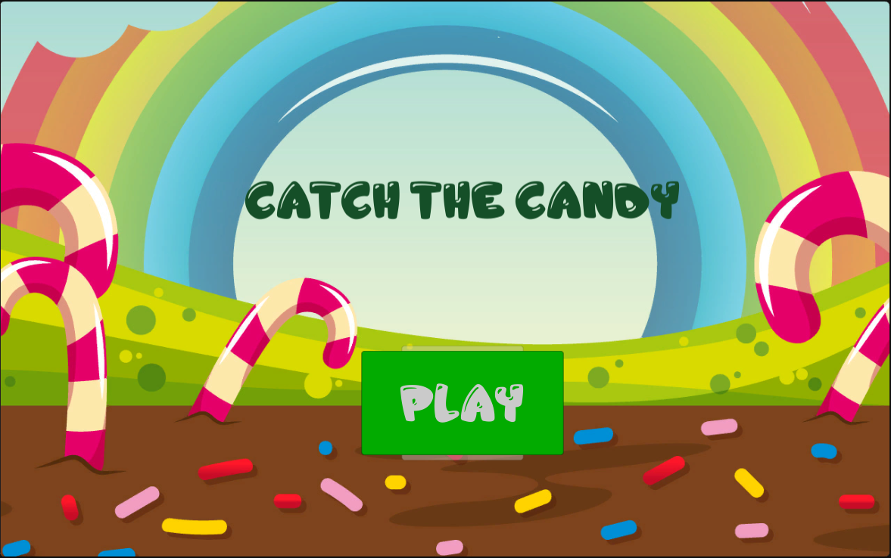
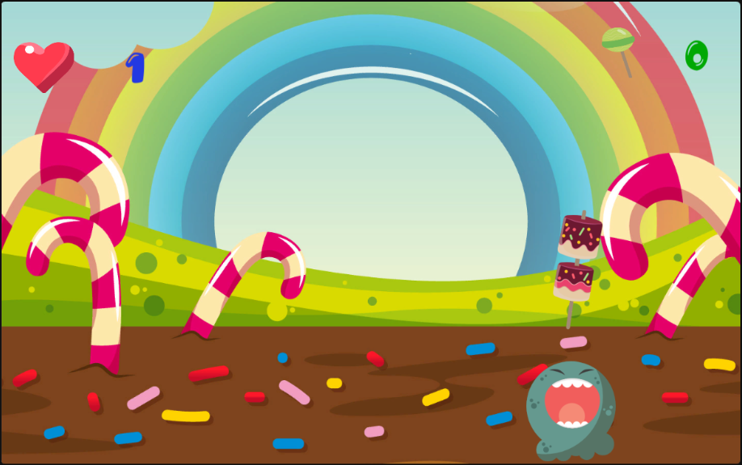
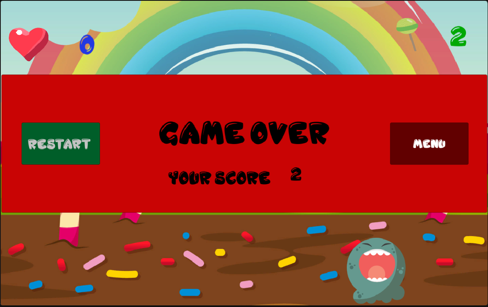

# Catch the candy

Uploaded [HERE](https://simmer.io/@luigib/candymonster)

Just a simple game made with Unity.

The player has to move the little monster left or right in order to catch all the candies that are falling.

## Needed tools

In order to be able to play the game locally, ```Python``` and ```Flask``` need to be installed because the local http server is made with flask.

```Flask``` can be installed via pip using: ```pip install flask```

## Demo

### Home



### Game



### Game Over Panel


