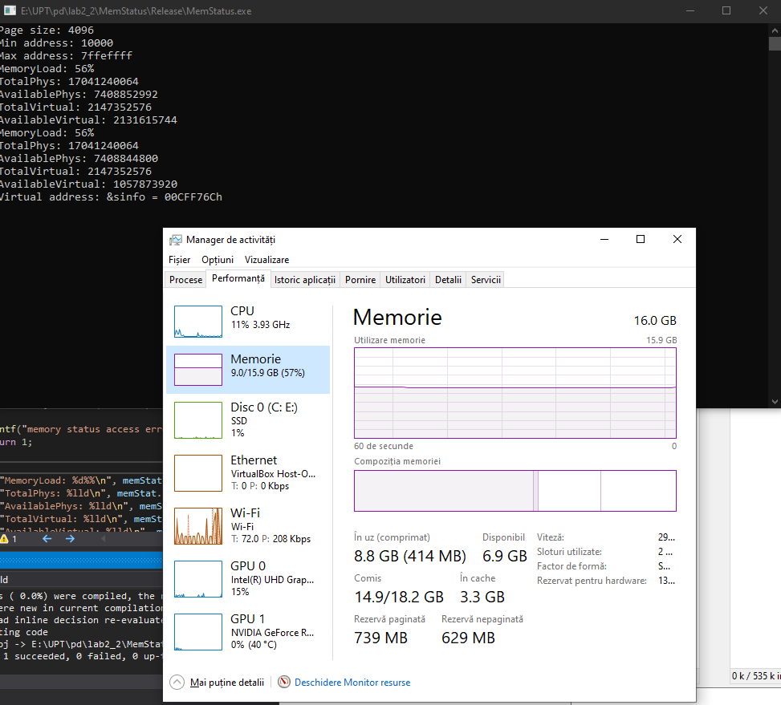
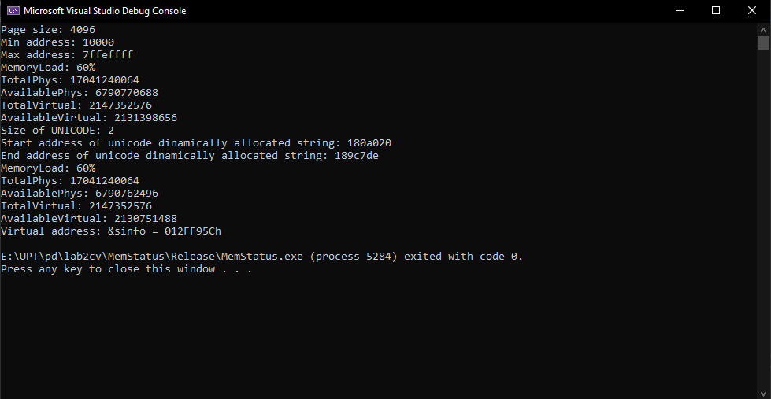

# Tema - laborator 2


## Detalii sistem
- *procesor*: *Intel I7-10750H*
- *memorie*: *16GB*
- *stocare*: *SSD de capacitate 512 GB*

#### Rezultate rulare cod initial


### Aplicatia

Enunt aplicatie:

*Alocați dinamic un șir UNICODE de 300000 caractere și inițializați toate elementele șirului cu 0. Afișați adresa primului și a ultimului element din șir. Care este dimensiunea în octeți alocată pentru șir?*

#### Alocarea sirului UNICODE
```c++
	WCHAR *wString = (WCHAR *)calloc(300000, sizeof(WCHAR));
	printf("%x\r\n", sizeof(WCHAR));
	printf("Start address of unicode dinamically allocated string: %x\r\n", wString);
	printf("End address of unicode dinamically allocated string: %x\r\n", &wString[299999]);
```
#### Rezultate


***600000*** octeti au fost alocati pentru sir in memorie(end address - start address + 1)


