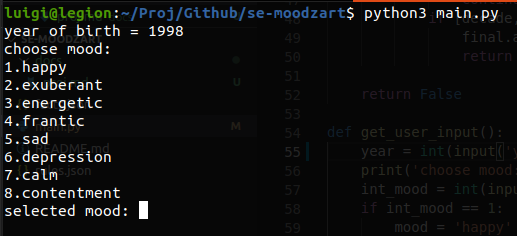

# Sisteme expert - proiect

# Sistem expert de recomandare de melodii

## Tehnologii
 - **Python 3.x**
 - **JSON**

## Utilizare
Interfata cu utilizatorul a acestui program este realizata prin intermediul consolei. \
In prima faza, utilizatorului ii este cerut anul de nastere pentru a-i putea sugera melodii din deceniul in care acesta s-a nascut. \
 \
Apoi utilizatorul isi va alege dispozitia curenta dintr-o lista care va fi afisata in consola, iar pe baza anului introdus si a dispozitiei curente, sistemul ii va sugera o lista de melodii(nume + link youtube) bazandu-se pe cele doua input-uri. \
 \
 \

## Descrierea sistemului
Sistemul este alcatuit din 
 - masina de inferenta(```main.py```)
 - setul de reguli(```rules.json```)
 - setul de facts(```facts.json```)

Bazandu-se pe datele introduse de utilizator, sistemul isi va verifica setul de reguli din fisierul ```rules.json``` si isi va construi lista de concluzii partiale in cazul in care se vor gasi reguli pentru input-ul utilizatorului. In caz contrar, utilizatorul va fi anuntat ca nu a fost gasita nicio regula. \
Dupa ce au fost gasite concluzii partiale pentru input(an & dispozitie), sistemul va cauta concluziile finale bazandu-se pe cele partiale.
In cazul in care au fost gasite concluziile finale, se vor cauta in functie de acestea melodiile in fisierul ```facts.json```.

### Clasificarea pe dispozitii a melodiilor
Clasificarea melodiilor in functie de dispozitia utilizatorului se face pe baza urmatorului tabel:
| Mood | Intensity | Timbre | Pitch | Rythm |
| ----- | ----- | ----- | ----- | ----- |
| Happy | Medium | Medium | Very high  | Very high |
| Exuberant | High | Medium | High | High |
| Energetic | Very High | Medium | Medium | High |
| Frantic | High | Very high | Low | Very high |
| Sad | Medium | Very low | Very low | Low |
| Depression | Low | Low | Low | Low |
| Calm | Very low | Very low | Medium | Very low |
| Contentment | Low | Low | High | Low |

Sursa: https://sites.tufts.edu/eeseniordesignhandbook/2015/music-mood-classification/

### Exemple reguli
**Regula partiala an**

```json
    {
        "condition": ["year >= 2000", "year < 2010"],
        "result": "2000s",
        "final": false
    }
```
**Regula partiala dispozitie**

```json
    {
        "condition": "mood == energetic",
        "result": "happy",
        "final": false
    }
```

**Regula finala**

```json
    {
        "condition": ["2000s", "energetic"],
        "result": ["check", "2000s", "energetic"],
        "final": true
    }
```

**Fact**
```json
    {
        "age": "2000s",
        "mood": "energetic",
        "name": "Bon Jovi - It's My Life",
        "url": "https://www.youtube.com/watch?v=vx2u5uUu3DE"
    }
```