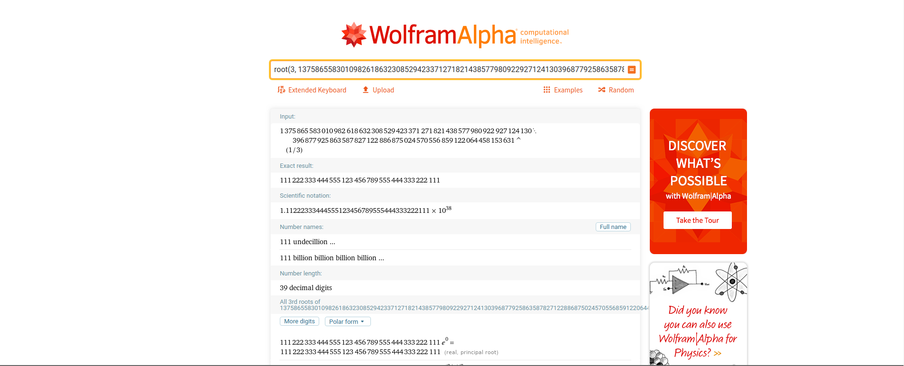

Encrypted message = root(e, c), where
> e = 3
> c = 1375865583010982618632308529423371271821438577980922927124130396877
      925863587827122886875024570556859122064458153631

No mod n, because e <<< n.

